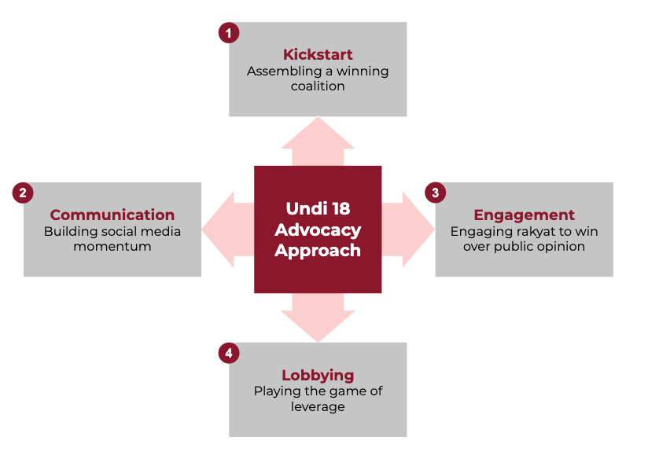

Undi18 built a powerful political movement that mobilized hundreds of thousands of Malaysian youth through social media. Online engagement with Undi18’s campaign material reached millions of impressions on Facebook and Twitter and more than a hundred thousand views on the campaign website in the four months ahead of parliament’s vote on the amendment.

We worked with grassroots organizations throughout Malaysia to disseminate campaign material and we cultivated campaign champions to shape the national narrative. We utilized digital marketing techniques together with strategic canvassing as part of our campaign strategy.

To achieve the constitutional amendment, we set out a 4-point approach for Undi18’s advocacy:

Through our latest digital campaigning projects and advocacy campaign, we aim to replicate the success of the Undi18 Advocacy Approach. Talk to us if you would like us to consult you on your campaign.